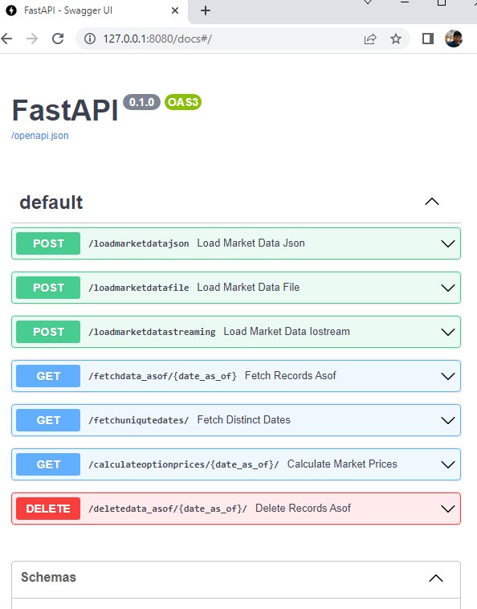
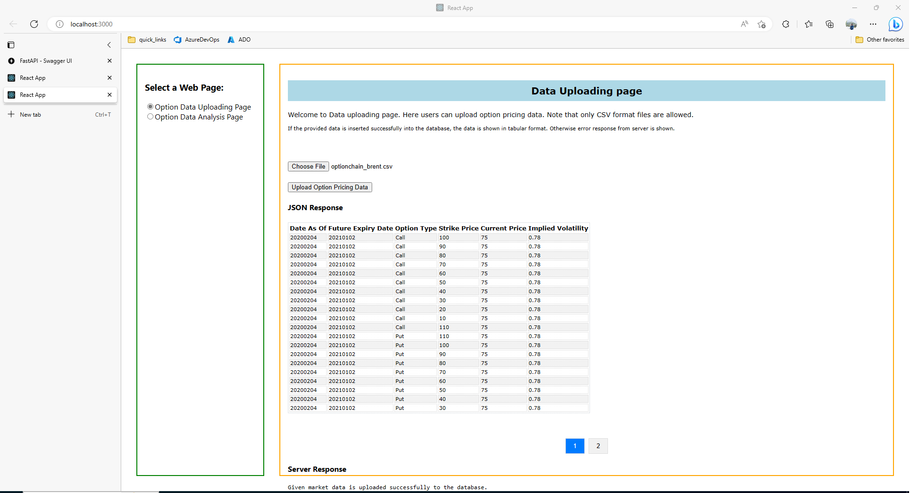
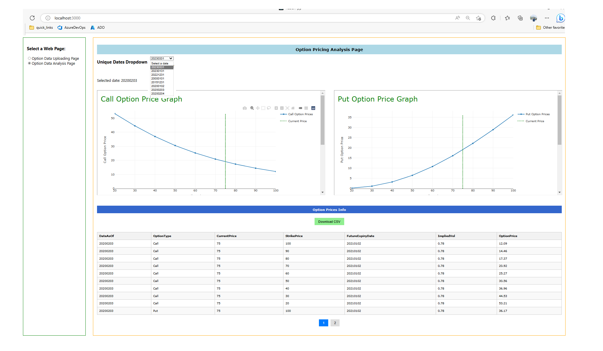

# Application Setup Instructions


This project is meant for showcasing the integration of:

1. Python FastApi,
2. R-Shiny, (To use Plotly as the visualization package)
3. React as front end for developing web pages

The application flow is as follows:
*	1. User can uploadg market data for option pricing in a CSV format.
*	2. Once the data is persisted into the database successfully, user can select a particular date to generate option prices.
*	3. The option price plot is shown in the web page. The option prices can also be downloaded in a CSV file.
	
Object relation mapping(SQLAlchemy) is used to make the application portable and database technology agnostic. For simplicity, SQLLite db is used for storing the data in this demo. 
Due to the restrictions of available features in the free versions of R-Connrect and R-Shiny server, some workarounds are chosen that mayn't be good application design choices in real world implementations.

This application has following interactions.

1. Market data loading and database persistence: React GUI  to upload the CSV file --> FastAPI POST call to persist the data to a Database
2. Fetch Unique dates: 	React dropdown list <----> FastAPI GET Call
3. Show Option Price Visualizations: React event trigger based on date selected <--> R-Shiny App(Plotly) <--> Fast API GET call fetch option prices 
4. Download calculated option  prices in a CSV file: React GUI <---> Fast API GET call. 

[See below screenshots of the application flow.](#screenshots)

## Instrunctions to setup FastApi server, R-Shiny server and React Server.

## Step 1: Setup Python environment and Run FastApi server

### Starting the Python FastApi Server

*	A) Setup Python virtual environment by installing required packages
*	B) Start FastApi server

Following commands can be used to perform these two steps:

#### Commands to create and start the Python Virtual Environment  and to run the FastAPI server

```bash
python -m venv .venv
.\.venv\Scripts\Activate.ps1
python .\src\api_manager.py
```

# Check if FastApi server is properly running

- Check on the link: http://127.0.0.1:8080/docs

## Step 2: Run R-Shiny for enabling Plotly visualizations

Run R-Shiny application to create Plotly visuals. These plotly visuals are embedded into React web pages.

Note that in the free version of Shiny server, custom URLs are not allowed. Only one shiny app can run on one port. As a simple workaround, two Shiny apps are started  separately to get Call and Put option pricing graphs on different ports.

Assuming that the user has installed R and required R packages such as Shiny and Plotly, set the current working folder to ".\RShiny_Plotly" in the command prompt and run the following R commands:

```R
# Define the file path for the R installation
location_R_Installation <- "C:/Program Files/R/R-4.2.3/bin"

# Define the directory path for the Option Pricer files
directory_path_option_pricer_files <- "C:/Users/WinVM2_2/Desktop/GitCommit/ShinyAppTest1/src_option_pricer/"
# Set the working directory to the Option Pricer files directory
setwd(directory_path_option_pricer_files)
# Create the command to run the call_option_visual.R script using RScript.exe
command1 <- paste0('"', normalizePath(file.path(location_R_Installation, "RScript.exe")), '" "', normalizePath(file.path(directory_path_option_pricer_files, "call_option_visual.R")), '"')
# Execute the call_option_visual.R script without waiting for it to finish
system(command1, wait = FALSE)
# Create the command to run the put_option_visual.R script using RScript.exe
command2 <- paste0('"', normalizePath(file.path(location_R_Installation, "RScript.exe")), '" "', normalizePath(file.path(directory_path_option_pricer_files, "put_option_visual.R")), '"')
# Execute the put_option_visual.R script without waiting for it to finish
system(command2, wait = FALSE)
```

## Step 3: Install React dependencies and run React Server.

* A) Setup React environment and install dependencies	   
* B) Start React server	
Go to the directory "react_frontend" and run the command terminal

```bash
	npm install --legacy-peer-deps
	npm start 
```

<a name="screenshots"></a>
### Screen shots of the application
<screenshots name="screenshots">







